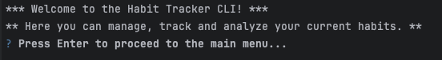
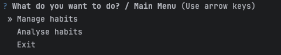

# Habit Tracker

Tracking your progress is crucial when trying to achieve goals like establishing new habits. Monitoring your efforts manually can, however, be very tedious and overwhelming.
A habit tracker simplifies this process, by making it easier to track and analyze your progress, which significantly boosts your chances of success.
<br>

This Habit Tracker App does exactly that, by allowing the user to users to create, manage and analyze their habits. 
Users can interact with the backend through a command-line interface and are able to create, delete, and increment habits by marking them as completed for a certain period. 
When analyzing currently tracked habits, users are able to answer what habits they are currently tracking, what their longest streak was and with which they were struggling the most.


## Features
- **Create Habits**: Add new daily or weekly habits with descriptions.
- **Track Progress**: Increment streaks for habits based on their periodicity.
- **Delete Habits**: Remove a habit and its associated tracking data.
- **Analyze Habits**:
  - List all tracked habits.
  - See all daily or weekly habits.
  - View the longest streak for a given habit.
  - Identify the habit with the longest streak across all habits.


## Technologies Used
- **Python**: Core programming language.
- **SQLite**: Database for persistent habit storage.
- **Questionary**: Interactive CLI for user-friendly menus.
- **Pytest**: For unit testing and ensuring code reliability.

## Installation
### Prerequisites
- Python 3.8 or later
- pip (Python package installer)
```shell
pip install -r requirements.txt
```

## Usage
Run the application
```shell
python main.py
```
At first you will be greeted with the following message:



Pressing "Enter" forwards you to the main menu



### Example Workflows

### 1. Add and increment habit
https://github.com/user-attachments/assets/628c1c32-2f71-496e-b809-6486b6e0f656


### 2. Analyse habits
https://github.com/user-attachments/assets/5af96f7b-3c9b-41cd-86e5-5c9bcd08cbb1


### 3. Delete
https://github.com/user-attachments/assets/ffecc350-5431-442b-b617-d0339b83cecf


## Database Schema

The database schema consists out of the following two tables:

### `habits` Table
| Column Name         | Data Type | Description                               |
|---------------------|-----------|-------------------------------------------|
| `name`              | TEXT      | Unique name of the habit (Primary Key).   |
| `description`       | TEXT      | Brief description of the habit.           |
| `periodicity`       | TEXT      | "Daily" or "Weekly".                      |
| `created_at`        | TEXT      | Timestamp of habit creation (ISO 8601).   |
| `current_streak`    | INT       | Current streak count.                     |
| `last_increment_date` | TEXT    | Timestamp of the last streak increment.   |

### `increments` Table
| Column Name     | Data Type | Description                             |
|-----------------|-----------|-----------------------------------------|
| `incremented_at`| TEXT      | Timestamp of the increment event.       |
| `habitName`     | TEXT      | Name of the habit (Foreign Key).        |
| `streak`        | INT       | Streak value at the time of increment.  |


## Testing


1.Install pytest: (if not done already)
```shell
pip install pytest
```
2. Run the tests:
```shell
pytest 
```


### Additional Comments

- When using PyCharm configure each script's run configuration to "Emulate terminal in output console". Otherwise questionary might not be working as expected.
- Alternatively run it in an external terminal or command prompt.
